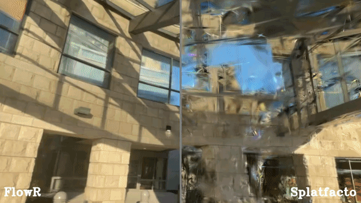

# FlowR: Flowing from Sparse to Dense 3D Reconstructions

<p align="center">
  
</p>

FlowR is a multi-view generative model built on flow matching that turns sparse-view 3D Gaussian Splatting reconstructions into high-quality dense reconstructions. Given a set of input views and initial 3DGS renders, FlowR generates photorealistic novel views that are then used to refine the 3D reconstruction.

## Overview

The FlowR pipeline consists of three stages:

1. **Stage 1 (Initial Reconstruction):** Fit a 3D Gaussian Splatting model to sparse input views and render all camera viewpoints.
2. **FlowR (Multi-view Generation):** A multi-view model conditioned on Plucker ray maps and Stage 1 renders generates high-quality novel views.
3. **Stage 2 (Refined Reconstruction):** Re-train 3DGS using both original and generated views for improved geometry and appearance.

---

## Table of Contents

- [Installation](#installation)
- [Data Preparation](#data-preparation)
  - [DL3DV-140 Benchmark](#dl3dv-140-benchmark)
  - [ScanNet++](#scannet)
- [Stage 1: Initial Reconstruction](#stage-1-initial-reconstruction)
- [FlowR: Multi-view Generation](#flowr-multi-view-generation)
  - [Training](#training)
  - [Inference](#inference)
- [Stage 2: Refined Reconstruction](#stage-2-refined-reconstruction)
- [Evaluation](#evaluation)
- [Citation](#citation)
- [Acknowledgements](#acknowledgements)

---

## Installation

Run the installer script from the repository root:

```bash
bash install.sh
conda activate flowr
```

`install.sh` creates a fresh `flowr` conda environment, installs CUDA Toolkit 12.2, a GCC 12 toolchain, and the native build dependencies into the env, installs the pinned PyTorch, PyTorch3D, and `pycolmap==3.11.1` packages, initializes the submodules, builds the repository-pinned COLMAP submodule with the headless options used by FlowR, and finally installs FlowR in editable mode.

<details>
<summary>Optional dependencies</summary>

```bash
# Visualization (rerun)
pip install -e ".[extra]"

# Development tools (formatting, linting, testing)
pip install -e ".[dev]"
```
</details>

---

## Data Preparation

FlowR uses processed datasets where each scene is stored as a zip archive (or directory) containing:

```
scene/
├── train/
│   ├── images/          # Training (input) views
│   └── renders/         # Stage 1 3DGS renders of training views
├── test/
│   ├── images/          # Held-out ground truth views
│   └── renders/         # Stage 1 3DGS renders of test views
├── other/               # (Optional) extra supervision or generated views
│   ├── images/
│   └── renders/
├── train_cameras.json   # Camera parameters per training image
├── test_cameras.json    # Camera parameters per test image
└── pointcloud.ply       # Initial sparse point cloud
```

For FlowR **training**, the `other` split provides additional target views. For **evaluation** scenes, `other` is conceptually optional: Stage 2 creates a fresh `other` split from the Stage 1 reconstruction via `generate_dataset`, so benchmark scenes only need the base reconstruction/evaluation content.

### Evaluation Data

Evaluation data is used for benchmarking. These scenes do not need a pre-generated `other` split, because Stage 2 synthesizes its own `other` cameras/views from the Stage 1 reconstruction.

#### DL3DV-140 Benchmark

The [DL3DV-140](https://dl3dv-10k.github.io/DL3DV-10K/) benchmark consists of 140 diverse scenes. We evaluate with **12-view** and **24-view** sparse input settings.

**Step 1:** Generate the dataset:

```bash
# 12-view setting
python -m flowr.prepare_dl3dv generate \
    <WORK_DIR> <DATA_DIR> <SCALE_DIR> \
    --subset 140 --views 12 --skip_other

# 24-view setting
python -m flowr.prepare_dl3dv generate \
    <WORK_DIR> <DATA_DIR> <SCALE_DIR> \
    --subset 140 --views 24 --skip_other
```

Where:
- `WORK_DIR`: Temporary working directory for downloads and intermediate files
- `DATA_DIR`: Final output directory for processed data
- `SCALE_DIR`: Directory containing per-scene `scale_factor.txt` files

`--skip_other` avoids materializing the optional evaluation-time `other` split.

**Step 2:** Verify that all scenes were processed successfully:

```bash
python -m flowr.prepare_dl3dv check <DATA_DIR> --subset 140 --views 12
```

#### ScanNet++

[ScanNet++](https://kaldir.vc.in.tum.de/scannetpp/) is an indoor scene dataset. We use the official `nvs_sem_val` split for evaluation.

**Step 1:** Download ScanNet++ following the [official instructions](https://kaldir.vc.in.tum.de/scannetpp/).

**Step 2:** Generate processed validation data:

```bash
python -m flowr.prepare_scannetpp generate \
    <SCANNETPP_ROOT> <WORK_DIR> <DATA_DIR> --split val --skip_other
```

Where:
- `SCANNETPP_ROOT`: Path to the downloaded ScanNet++ dataset
- `WORK_DIR`: Temporary working directory
- `DATA_DIR`: Final output directory

**Step 3:** Verify:

```bash
python -m flowr.prepare_scannetpp check <SCANNETPP_ROOT> <DATA_DIR> --split val
```

### Training Data

Training data keeps the `other` split because it provides additional supervision targets for the FlowR model.

#### DL3DV-10K Training Subsets

For training the FlowR model, we use the full DL3DV-10K dataset with 6-36 random, sparse input views:

```bash
python -m flowr.prepare_dl3dv generate \
    <WORK_DIR> <DATA_DIR> <SCALE_DIR> \
    --subset <SUBSET> --views 6 36
```

Where `SUBSET` is one of: `1K`, `2K`, `3K`, `4K`, `5K`, `6K`, `7K`, `8K`, `9K`, `10K`.

#### ScanNet++ Training Split

For FlowR training on ScanNet++, prepare the `nvs_sem_train` split:

```bash
python -m flowr.prepare_scannetpp generate \
    <SCANNETPP_ROOT> <WORK_DIR> <DATA_DIR> --split train
```

---

## Stage 1: Initial Reconstruction

Stage 1 fits a 3D Gaussian Splatting model from sparse input views using the `splatfacto-instant` workflow (5K iterations):

```bash
python -m flowr.reconstruct splatfacto-instant \
    --pipeline.datamanager.dataparser.data <SCENE_DIR> \
    --max-num-iterations 5001
```

**This is automatically run as part of the data preparation scripts above.**

---

## FlowR: Multi-view Generation

FlowR is a multi-view conditional flow matching model that takes Stage 1 renders and Plucker rays as input and generates photorealistic novel views. During FlowR training, the `train` split is used for reference views, while `test` and `other` provide target supervision when available.

NOTE: We originally used a Meta proprietary model and therefore provide training and inference code for a Stable Diffusion 3 based version of FlowR instead.

### Training

Train FlowR using Accelerate with the provided config:

```bash
# Single GPU
python -m flowr.train --config-path=configs --config-name=flowr-512.yaml

# Multi-GPU (e.g., 8 GPUs)
accelerate launch --num_processes 8 \
    -m flowr.train --config-path=configs --config-name=flowr-512.yaml
```

The default training config excludes known problematic DL3DV sequences via `assets/dl3dv_invalid.txt`:

```yaml
invalid_sequences_files:
  - assets/dl3dv_invalid.txt
  - ""
```

**Key configuration options** (in `src/flowr/training/configs/`):

| Config | Resolution | Views | Description |
|--------|-----------|-------|-------------|
| `flowr-512.yaml` | 512 | 12 (6 tgt + 2 ref + 4 random) | Base model training |
| `flowr-960.yaml` | 960 | 6 (2 tgt + 2 ref + 2 random) | High-resolution finetuning |

**Resume training** from a checkpoint:

```bash
python -m flowr.train \
    --config-path <ABSOLUTE_PATH_TO_MODEL_DIR> \
    --config-name=config.yaml \
    ++resume_from_checkpoint=latest
```

### Inference

**Run the test loop** to evaluate on held-out views:

```bash
python -m flowr.test --config <PATH_TO_MODEL_CONFIG>/config.yaml
```

**Generate novel views** for a specific scene (used to populate the `other/images` split of a Stage 2 dataset):

```bash
python -m flowr.generate_views \
    --config <PATH_TO_MODEL_CONFIG>/config.yaml \
    --input_dir <SCENE_DIR> \
    --num_views 64
```

---

## Stage 2: Refined Reconstruction

Stage 2 re-trains the 3DGS model using both original and FlowR-generated views.

`generate_dataset` creates a fresh Stage 2 scene directory with `train`, `test`, and `other` splits. The `other` split is generated from the Stage 1 reconstruction and does not rely on the input scene already containing an `other` split.

**Step 1:** Generate a dataset with novel camera viewpoints and initial renders:

```bash
python -m flowr.generate_dataset \
    --model <PATH_TO_STAGE1_CONFIG>/config.yml \
    --input_dir <ORIGINAL_SCENE_DIR> \
    --output_dir <STAGE2_SCENE_DIR> \
    --num_views 64 \
    --method interpolation
```

You can also pass an exported Stage 1 splat `.ply` to `--model` instead of a training config.

View selection methods: `interpolation` (default) and `perturbation`.

**Step 2:** Run FlowR inference to generate high-quality views at the selected cameras:

```bash
python -m flowr.generate_views \
    --config <FLOWR_MODEL_CONFIG>/config.yaml \
    --input_dir <STAGE2_SCENE_DIR> \
    --num_views 64
```

This writes the generated images into `<STAGE2_SCENE_DIR>/other/images`.

**Step 3:** Train the refined 3DGS model:

```bash
python -m flowr.reconstruct splatfacto-default \
    --max-num-iterations 30001 \
    image \
    --data <STAGE2_SCENE_DIR> \
    --use-generated True
```

With `--use-generated True`, the reconstruction dataparser appends the `other` split to the training set and the model applies an alternative loss to generated samples.

---

## Evaluation

Evaluate a trained 3DGS model on held-out test views:

```bash
python -m flowr.eval --load-config <PATH_TO_CONFIG>/config.yml
```

Render camera trajectories or individual views:

```bash
python -m flowr.render --load-config <PATH_TO_CONFIG>/config.yml
```

---

## Citation

```bibtex
@InProceedings{fischer2025flowr,
    author    = {Tobias Fischer and Samuel Rota Bul{\`o} and Yung-Hsu Yang and Nikhil Keetha and Lorenzo Porzi and Norman M\"uller and Katja Schwarz and Jonathon Luiten and Marc Pollefeys and Peter Kontschieder},
    title     = {{FlowR}: Flowing from Sparse to Dense 3D Reconstructions},
    booktitle = {Proceedings of the IEEE/CVF International Conference on Computer Vision (ICCV)},
    year      = {2025}
}
```

## Acknowledgements

This project builds upon [diffusers](https://github.com/huggingface/diffusers/tree/main), [nerfstudio](https://nerf.studio/), and [gsplat](https://docs.gsplat.studio/). We thank the authors of these projects for making their code available.

## License

This project is licensed under the Apache 2.0 License. See [LICENSE](LICENSE) for details.
